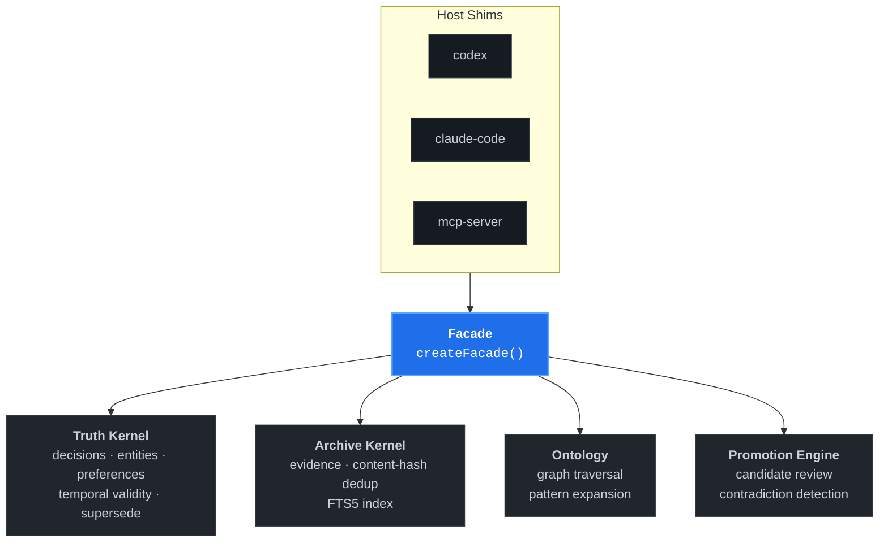

<p align="right">
  <a href="./README.md">English</a> ·
  <strong>한국어</strong> ·
  <a href="./README.zh.md">中文</a>
</p>

<p align="center">
  
</p>

<p align="center">
  <strong>코딩 에이전트를 위한 로컬 퍼스트 외부 두뇌.</strong><br/>
  SQLite 기반 CLI가 Claude Code · Codex · MCP 클라이언트에 <em>클라우드 의존성 없이</em> 지속적인 컨텍스트, 그래프 인지 리콜, 거버넌스 메모리를 제공합니다.
</p>

<p align="center">
  <a href="https://www.npmjs.com/package/waypath"></a>
  <a href="./LICENSE"></a>
  <a href="https://nodejs.org/"></a>
  
  <a href="https://www.npmjs.com/package/waypath"></a>
  <a href="https://github.com/TheStack-ai/waypath/stargazers"></a>
  <a href="https://github.com/punkpeye/awesome-mcp-servers#knowledge-and-memory"></a>
</p>

> [!TIP]
> 처음이시라면 아래 [빠른 시작](#빠른-시작)부터 보세요. `npm install`부터 첫 영속 세션까지 약 60초면 됩니다.

---

## Waypath가 뭔가요?

Waypath는 **코딩 에이전트와 개인 개발자를 위한 로컬 퍼스트 지식 엔진**입니다.
프로젝트 결정 사항, 엔티티 관계, 세션 산출물을 하나의 SQLite 파일에 저장하고, 얇은 CLI를 통해 Claude Code · Codex · MCP 클라이언트 어느 호스트에든 **그래프 인지·진실 우선 컨텍스트**를 공급합니다.

클라우드 메모리 서비스와 달리 Waypath는:

- **완전히 로컬**에서 동작하고,
- 벡터 블롭이 아닌 **정규 진실 스키마(canonical truth schema)**를 직접 소유하며,
- 모든 메모리를 **명시적 promote + review 게이트**로 다루고,
- **필수 런타임 서비스 없이** 77 kB npm 패키지로 배포됩니다.

## 왜 Waypath를 써야 하나요?

| 문제 | Waypath의 답 |
|---|---|
| 세션 간 에이전트 기억 소실 | 영속 SQLite truth kernel |
| RAG가 관련 없는 chunk 반환 | FTS5 + RRF 하이브리드 랭킹 + 그래프 확장 |
| 메모리 서비스의 조용한 환각 | 명시적 `page → promote → review` 거버넌스 |
| 클라우드 락인, 데이터 유출 | 한 개의 로컬 `.db` 파일, 전적으로 본인 소유 |
| 호스트마다 다른 도구 (Claude, Codex, Cursor…) | 단일 facade + 얇은 host shim + 내장 MCP 서버 |

## 설치

> [!IMPORTANT]
> **Node.js ≥ 22** 필요. Node 22.5+에서 네이티브 `node:sqlite` 드라이버 사용 가능, 그 이하는 `better-sqlite3`로 자동 fallback 됩니다.

```bash
npm install -g waypath
```

확인:

```bash
waypath --help
waypath source-status --json
```

## 빠른 시작

**1. 세션 부트스트랩** (Codex 예시):

```bash
waypath codex --json \
  --project my-project \
  --objective "retrieval 파이프라인 v2 출시" \
  --task  "하이브리드 랭커 리팩터" \
  --store-path ~/.waypath/my-project.db
```

**2. 관련 컨텍스트 리콜:**

```bash
waypath recall --query "하이브리드 랭커 결정사항" --json
```

**3. 정제된 인사이트를 page로 캡처하고 review로 승격:**

```bash
waypath page    --subject "하이브리드 랭커 v2 설계"
waypath promote --subject "하이브리드 랭커 v2 설계"
waypath review-queue --json
```

**4. MCP 서버로 실행** (Claude Code · Cursor · 모든 MCP 클라이언트용):

```bash
waypath mcp-server --store-path ~/.waypath/my-project.db
```

## 실제 출력 예시

```bash
$ waypath codex --json --project auth-service \
    --objective "passkey 전환" --task "플로우 설계"
{
  "host": "codex",
  "session_id": "auth-service:passkey-flow",
  "context_pack": {
    "truth_highlights": {
      "decisions": [
        "WebAuthn Level 2, user verification required",
        "패스워드 fallback은 Argon2id 해싱"
      ],
      "entities": ["UserSession", "AuthGateway", "RefreshToken"],
      "contradictions": []
    },
    "recent_pages": [
      "세션 스토리지 설계 — 2026-04-12 승격됨"
    ]
  }
}
```

## 커맨드 개요

| 분류 | 커맨드 |
|------|--------|
| **세션 부트스트랩** | `codex`, `claude-code`, `mcp-server` |
| **리콜** | `recall`, `explain`, `graph-query`, `history` |
| **Page (정제된 지식)** | `page`, `promote`, `refresh-page`, `inspect-page` |
| **Review 거버넌스** | `review`, `review-queue`, `inspect-candidate`, `resolve-contradiction` |
| **Import / scan** | `import-seed`, `import-local`, `scan` |
| **Health** | `source-status`, `health`, `db-stats`, `rebuild-fts` |
| **운영** | `backup`, `benchmark`, `export` |

전체 도움말: `waypath --help`.

## 아키텍처

Waypath는 얇은 facade 뒤에 4개의 독립된 커널로 구성됩니다:



- **Truth kernel** — decisions · entities · preferences의 정규 스키마, temporal validity(schema v3) + supersede + history.
- **Archive kernel** — raw evidence 저장소, content-hash dedup + FTS5 전문 검색.
- **Ontology layer** — entity/decision 확장을 위한 그래프 순회 (패턴: `project_context`, `person_context`, `system_reasoning`, `contradiction_lookup`).
- **Promotion engine** — 후보 검토, 모순 탐지, supersede 플로우.

`createFacade()` 하나가 14개의 verb를 노출하고, host shim이 각 에이전트의 부트스트랩 프로토콜에 맞춥니다.

## 설정

Waypath는 **기본 제로 설정**입니다. 리트리벌 가중치, 어댑터 토글, 리뷰 한도를 튜닝하려면 작업 디렉터리에 `config.toml`을 두거나 `WAYPATH_CONFIG_PATH`를 지정:

```toml
[source_adapters]
jarvis-memory-db = true
jarvis-brain-db  = false

[retrieval.source_system_weights]
truth-kernel = 1.2

[retrieval.source_kind_weights]
decision = 0.9
memory   = 0.5

[review_queue]
limit = 12
```

env 변수로 개별 override:

```bash
export WAYPATH_RECALL_WEIGHT_SOURCE_SYSTEM_TRUTH_KERNEL=1.8
export WAYPATH_REVIEW_QUEUE_LIMIT=8
```

**우선순위:** `env override > config.toml > 기본값`.

## MCP 서버

Waypath는 네이티브 MCP(Model Context Protocol) 서버를 별도 바이너리로 제공합니다:

```bash
waypath-mcp-server
```

또는 메인 CLI에서:

```bash
waypath mcp-server --store-path ~/.waypath/project.db
```

MCP로 노출되는 도구: `recall`, `page`, `promote`, `review`, `graph-query`, `source-status`.

## 요구사항

- **Node.js ≥ 22.0** (필수)
- **Node.js ≥ 22.5** 권장 — 네이티브 `node:sqlite` 활성화
- `better-sqlite3` 는 22.0–22.4 또는 네이티브 sqlite 불가 환경에서의 자동 fallback

## 상태

- **버전:** 0.1.0 — 최초 공개 릴리스
- **테스트:** 131개 pass (단위 + 통합 + 벤치마크)
- **안정화된 표면:** CLI(26개 커맨드), MCP 서버, facade API
- **연기됨:** hosted 배포, multi-user sync, adaptive ranking feedback

## 대안 비교

| | Waypath | 클라우드 메모리 (mem0, zep) | 벡터 전용 RAG |
|---|:---:|:---:|:---:|
| 로컬 퍼스트 | ✓ | ✗ | 경우에 따라 |
| 정규 진실 스키마 | ✓ | ✗ | ✗ |
| 그래프 인지 리콜 | ✓ | 부분 | ✗ |
| 명시적 review 게이트 | ✓ | ✗ | ✗ |
| 내장 MCP 서버 | ✓ | ✗ | ✗ |
| 한 방 설치 | ✓ | 서비스 필요 | 케이스별 |

## 기여

Waypath는 **host shim**, **source adapter**, 버그 수정 기여를 환영합니다. 첫 기여자용 이슈는 [이렇게 라벨링되어 있습니다](https://github.com/TheStack-ai/waypath/issues?q=is%3Aopen+label%3A%22good+first+issue%22).

개발 셋업 · 코드 스타일 · PR 프로세스는 **[CONTRIBUTING.md](./CONTRIBUTING.md)** 를 참고하세요.

PR 전:

```bash
npm run build
npm test
```

## 라이선스

**MIT** © [TheStack.ai](https://github.com/TheStack-ai) — [LICENSE](./LICENSE) 참조.
