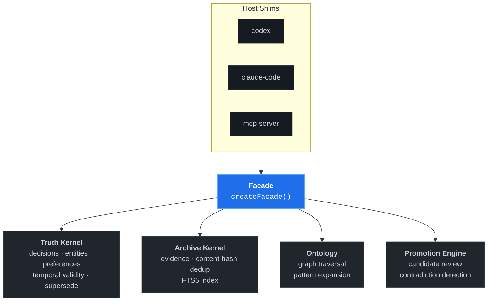

<p align="right">
  <strong>English</strong> ·
  <a href="./README.ko.md">한국어</a> ·
  <a href="./README.zh.md">中文</a>
</p>

<p align="center">
  
</p>

<p align="center">
  <strong>Local-first external brain for coding agents.</strong><br/>
  A SQLite-backed CLI that gives Claude Code, Codex, and any MCP client persistent context, graph-aware recall, and governed memory — with <em>zero cloud dependencies</em>.
</p>

<p align="center">
  <a href="https://www.npmjs.com/package/waypath"></a>
  <a href="./LICENSE"></a>
  <a href="https://nodejs.org/"></a>
  
  <a href="https://www.npmjs.com/package/waypath"></a>
  <a href="https://github.com/TheStack-ai/waypath/stargazers"></a>
  <a href="https://github.com/punkpeye/awesome-mcp-servers#knowledge-and-memory"></a>
</p>

> [!TIP]
> New here? The [Quick start](#quick-start) gets you from `npm install` to your first persistent agent session in about 60 seconds.

---

## What is Waypath?

Waypath is a **local-first knowledge engine** for coding agents and solo developers.
It stores your project decisions, entity relationships, and session artifacts in a single SQLite file, then serves **graph-aware, truth-first context** to any agent host — Claude Code, Codex, or an MCP client — through a thin CLI.

Unlike cloud memory services, Waypath:

- runs entirely on your machine,
- owns a **canonical truth schema** instead of a vector blob,
- treats every memory as first-class with **explicit promotion + review gates**,
- ships a 77 kB npm package with **no required runtime services**.

## Why Waypath?

| Problem | Waypath's answer |
|---|---|
| Agents forget across sessions | Persistent SQLite truth kernel |
| RAG returns irrelevant chunks | FTS5 + RRF hybrid ranking with graph expansion |
| Memory services hallucinate silently | Explicit `page → promote → review` governance |
| Cloud lock-in, data exfiltration | Everything is one local `.db` file you own |
| Tool per host (Claude, Codex, Cursor) | Single facade, thin host shims, native MCP server |

## Install

> [!IMPORTANT]
> Requires **Node.js ≥ 22**. Node 22.5+ unlocks the native `node:sqlite` driver; earlier 22.x versions auto-fall back to `better-sqlite3`.

```bash
npm install -g waypath
```

Verify:

```bash
waypath --help
waypath source-status --json
```

## Quick start

**1. Bootstrap a session** (Codex example):

```bash
waypath codex --json \
  --project my-project \
  --objective "ship v2 of the retrieval pipeline" \
  --task  "refactor hybrid ranker" \
  --store-path ~/.waypath/my-project.db
```

**2. Recall relevant context:**

```bash
waypath recall --query "hybrid ranker decisions" --json
```

**3. Capture a distilled insight and promote it through review:**

```bash
waypath page    --subject "hybrid ranker v2 design"
waypath promote --subject "hybrid ranker v2 design"
waypath review-queue --json
```

**4. Run as an MCP server** (for Claude Code, Cursor, any MCP client):

```bash
waypath mcp-server --store-path ~/.waypath/my-project.db
```

## See it in action

```bash
$ waypath codex --json --project auth-service \
    --objective "migrate to passkeys" --task "design flow"
{
  "host": "codex",
  "session_id": "auth-service:passkey-flow",
  "context_pack": {
    "truth_highlights": {
      "decisions": [
        "Use WebAuthn level 2 with user verification required",
        "Argon2id for password fallback hashing"
      ],
      "entities": ["UserSession", "AuthGateway", "RefreshToken"],
      "contradictions": []
    },
    "recent_pages": [
      "Session storage design — promoted 2026-04-12"
    ]
  }
}
```

## Command surface

| Area | Commands |
|------|----------|
| **Session bootstrap** | `codex`, `claude-code`, `mcp-server` |
| **Recall** | `recall`, `explain`, `graph-query`, `history` |
| **Pages (distilled knowledge)** | `page`, `promote`, `refresh-page`, `inspect-page` |
| **Review governance** | `review`, `review-queue`, `inspect-candidate`, `resolve-contradiction` |
| **Import / scan** | `import-seed`, `import-local`, `scan` |
| **Health** | `source-status`, `health`, `db-stats`, `rebuild-fts` |
| **Maintenance** | `backup`, `benchmark`, `export` |

Full help: `waypath --help`.

## Architecture

Waypath is built from four independent kernels behind a thin facade:



- **Truth kernel** — canonical decisions, entities, preferences, temporal validity (schema v3 with supersede + history).
- **Archive kernel** — raw evidence store with content-hash dedup and FTS5 full-text index.
- **Ontology layer** — graph traversal for entity/decision context expansion (patterns: `project_context`, `person_context`, `system_reasoning`, `contradiction_lookup`).
- **Promotion engine** — candidate review, contradiction detection, supersede flows.

A single `createFacade()` exposes 14 verbs. Host shims adapt it to each agent's bootstrap protocol.

## Configuration

Waypath is **zero-config by default**. To tune retrieval weights, adapter toggles, or review thresholds, drop a `config.toml` in your working directory (or point `WAYPATH_CONFIG_PATH` at one):

```toml
[source_adapters]
jarvis-memory-db = true
jarvis-brain-db  = false

[retrieval.source_system_weights]
truth-kernel = 1.2

[retrieval.source_kind_weights]
decision = 0.9
memory   = 0.5

[review_queue]
limit = 12
```

Override anything via env vars:

```bash
export WAYPATH_RECALL_WEIGHT_SOURCE_SYSTEM_TRUTH_KERNEL=1.8
export WAYPATH_REVIEW_QUEUE_LIMIT=8
```

**Priority:** `env override > config.toml > built-in defaults`.

## MCP server

Waypath ships a native MCP (Model Context Protocol) server as a second binary:

```bash
waypath-mcp-server
```

Or via the main CLI:

```bash
waypath mcp-server --store-path ~/.waypath/project.db
```

Tools exposed via MCP: `recall`, `page`, `promote`, `review`, `graph-query`, `source-status`.

## Requirements

- **Node.js ≥ 22.0** (required)
- **Node.js ≥ 22.5** recommended — unlocks native `node:sqlite`
- `better-sqlite3` is an **optional** fallback auto-used on 22.0–22.4 or where native sqlite is unavailable

## Status

- **Version:** 0.1.0 — first public release
- **Tests:** 131 passing (unit + integration + benchmark)
- **Stable surface:** CLI (26 commands), MCP server, facade API
- **Deferred:** hosted deployment, multi-user sync, adaptive ranking feedback

## Compared to alternatives

| | Waypath | Cloud memory (mem0, zep) | Vector-only RAG |
|---|:---:|:---:|:---:|
| Local-first | ✓ | ✗ | depends |
| Canonical truth schema | ✓ | ✗ | ✗ |
| Graph-aware recall | ✓ | partial | ✗ |
| Explicit review gate | ✓ | ✗ | ✗ |
| MCP server built-in | ✓ | ✗ | ✗ |
| One-file install | ✓ | needs service | varies |

## Contributing

Waypath welcomes **host shims**, **source adapters**, and bug fixes. Good first issues are [labeled accordingly](https://github.com/TheStack-ai/waypath/issues?q=is%3Aopen+label%3A%22good+first+issue%22).

Read **[CONTRIBUTING.md](./CONTRIBUTING.md)** for dev setup, code style, and PR flow.

Before submitting a PR:

```bash
npm run build
npm test
```

## License

**MIT** © [TheStack.ai](https://github.com/TheStack-ai) — see [LICENSE](./LICENSE).
