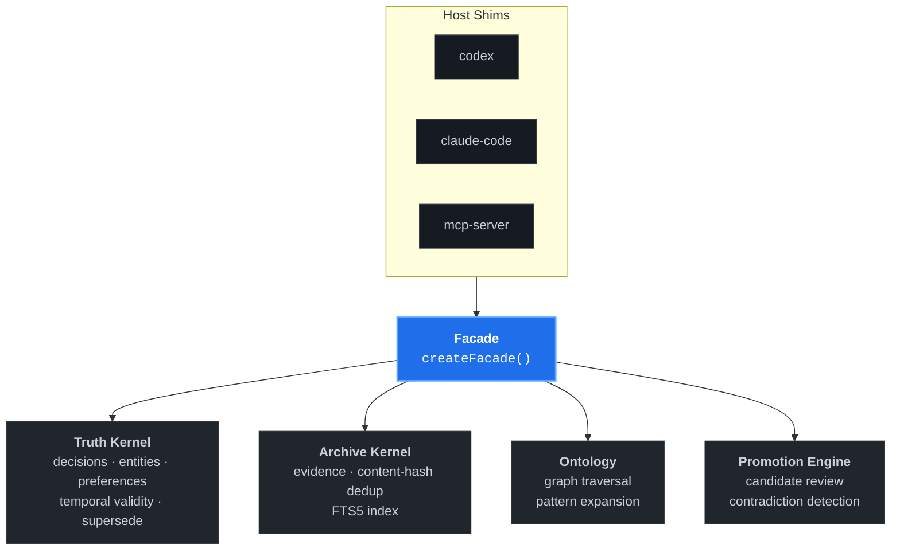

<p align="right">
  <a href="./README.md">English</a> ·
  <a href="./README.ko.md">한국어</a> ·
  <strong>中文</strong>
</p>

<p align="center">
  
</p>

<p align="center">
  <strong>面向编码代理的本地优先外部大脑。</strong><br/>
  基于 SQLite 的 CLI，为 Claude Code、Codex 和任何 MCP 客户端提供持久化上下文、图感知召回和受治理的记忆 — <em>零云依赖</em>。
</p>

<p align="center">
  <a href="https://www.npmjs.com/package/waypath"></a>
  <a href="./LICENSE"></a>
  <a href="https://nodejs.org/"></a>
  
  <a href="https://www.npmjs.com/package/waypath"></a>
  <a href="https://github.com/TheStack-ai/waypath/stargazers"></a>
  <a href="https://github.com/punkpeye/awesome-mcp-servers#knowledge-and-memory"></a>
</p>

> [!TIP]
> 第一次使用？从下方 [快速开始](#快速开始) 看起。从 `npm install` 到第一次持久化代理会话,大约 60 秒。

---

## 什么是 Waypath？

Waypath 是一款**面向编码代理和独立开发者的本地优先知识引擎**。
它将你的项目决策、实体关系和会话产物保存在单个 SQLite 文件中,并通过一个轻量 CLI 向任意代理宿主 — Claude Code、Codex 或 MCP 客户端 — 提供**图感知、真相优先的上下文**。

与云端记忆服务不同,Waypath:

- 完全在你本地运行,
- 拥有**规范的真相模式(canonical truth schema)**,而非向量 blob,
- 以**显式的 promote + review 关卡**对待每一条记忆,
- 作为 77 kB 的 npm 包分发,**无需任何运行时服务**。

## 为什么选 Waypath？

| 问题 | Waypath 的答案 |
|---|---|
| 代理跨会话遗忘 | 持久化 SQLite truth kernel |
| RAG 返回无关片段 | FTS5 + RRF 混合排序 + 图扩展 |
| 记忆服务静默幻觉 | 显式 `page → promote → review` 治理 |
| 云锁定、数据外泄 | 一个本地 `.db` 文件,完全由你掌握 |
| 每个宿主一套工具 (Claude、Codex、Cursor…) | 单一 facade + 轻量 host shim + 内置 MCP 服务器 |

## 安装

> [!IMPORTANT]
> 需要 **Node.js ≥ 22**。Node 22.5+ 可启用原生 `node:sqlite` 驱动;低于此版本会自动回退到 `better-sqlite3`。

```bash
npm install -g waypath
```

验证:

```bash
waypath --help
waypath source-status --json
```

## 快速开始

**1. 引导一个会话**(以 Codex 为例):

```bash
waypath codex --json \
  --project my-project \
  --objective "发布检索管线 v2" \
  --task  "重构混合排序器" \
  --store-path ~/.waypath/my-project.db
```

**2. 召回相关上下文:**

```bash
waypath recall --query "混合排序器决策" --json
```

**3. 捕获一条蒸馏洞察并通过 review 升级:**

```bash
waypath page    --subject "混合排序器 v2 设计"
waypath promote --subject "混合排序器 v2 设计"
waypath review-queue --json
```

**4. 作为 MCP 服务器运行** (适用于 Claude Code、Cursor、任何 MCP 客户端):

```bash
waypath mcp-server --store-path ~/.waypath/my-project.db
```

## 实际输出示例

```bash
$ waypath codex --json --project auth-service \
    --objective "迁移到 passkey" --task "设计流程"
{
  "host": "codex",
  "session_id": "auth-service:passkey-flow",
  "context_pack": {
    "truth_highlights": {
      "decisions": [
        "使用 WebAuthn Level 2, 要求 user verification",
        "密码回退方案采用 Argon2id 哈希"
      ],
      "entities": ["UserSession", "AuthGateway", "RefreshToken"],
      "contradictions": []
    },
    "recent_pages": [
      "会话存储设计 — 2026-04-12 已升级"
    ]
  }
}
```

## 命令总览

| 分类 | 命令 |
|------|------|
| **会话引导** | `codex`, `claude-code`, `mcp-server` |
| **召回** | `recall`, `explain`, `graph-query`, `history` |
| **Page (蒸馏知识)** | `page`, `promote`, `refresh-page`, `inspect-page` |
| **Review 治理** | `review`, `review-queue`, `inspect-candidate`, `resolve-contradiction` |
| **导入 / 扫描** | `import-seed`, `import-local`, `scan` |
| **健康检查** | `source-status`, `health`, `db-stats`, `rebuild-fts` |
| **运维** | `backup`, `benchmark`, `export` |

完整帮助: `waypath --help`.

## 架构

Waypath 由一个轻量 facade 背后的四个独立 kernel 组成:



- **Truth kernel** — 规范化的 decisions · entities · preferences,带 temporal validity(schema v3)+ supersede + history。
- **Archive kernel** — 原始 evidence 存储,带 content-hash 去重 + FTS5 全文索引。
- **Ontology layer** — 用于 entity/decision 扩展的图遍历 (模式: `project_context`, `person_context`, `system_reasoning`, `contradiction_lookup`)。
- **Promotion engine** — 候选评审、冲突检测、supersede 流程。

`createFacade()` 暴露 14 个 verb,host shim 将其适配到每个代理的引导协议。

## 配置

Waypath **默认零配置**。若要调整检索权重、适配器开关或评审阈值,请在工作目录放置 `config.toml`,或通过 `WAYPATH_CONFIG_PATH` 指向一个:

```toml
[source_adapters]
jarvis-memory-db = true
jarvis-brain-db  = false

[retrieval.source_system_weights]
truth-kernel = 1.2

[retrieval.source_kind_weights]
decision = 0.9
memory   = 0.5

[review_queue]
limit = 12
```

通过环境变量覆盖:

```bash
export WAYPATH_RECALL_WEIGHT_SOURCE_SYSTEM_TRUTH_KERNEL=1.8
export WAYPATH_REVIEW_QUEUE_LIMIT=8
```

**优先级:** `env override > config.toml > 内置默认值`。

## MCP 服务器

Waypath 以第二个二进制提供原生 MCP (Model Context Protocol) 服务器:

```bash
waypath-mcp-server
```

或通过主 CLI:

```bash
waypath mcp-server --store-path ~/.waypath/project.db
```

通过 MCP 暴露的工具: `recall`, `page`, `promote`, `review`, `graph-query`, `source-status`。

## 环境要求

- **Node.js ≥ 22.0** (必需)
- **Node.js ≥ 22.5** 推荐 — 启用原生 `node:sqlite`
- `better-sqlite3` 是**可选** fallback,在 22.0–22.4 或原生 sqlite 不可用时自动使用

## 状态

- **版本:** 0.1.0 — 首个公开发布
- **测试:** 131 个通过 (单元 + 集成 + 基准)
- **稳定表面:** CLI (26 个命令)、MCP 服务器、facade API
- **延期项:** 托管部署、多用户同步、自适应排序反馈

## 与替代方案对比

| | Waypath | 云记忆 (mem0, zep) | 纯向量 RAG |
|---|:---:|:---:|:---:|
| 本地优先 | ✓ | ✗ | 视情况 |
| 规范真相模式 | ✓ | ✗ | ✗ |
| 图感知召回 | ✓ | 部分 | ✗ |
| 显式 review 关卡 | ✓ | ✗ | ✗ |
| 内置 MCP 服务器 | ✓ | ✗ | ✗ |
| 一键安装 | ✓ | 需要服务 | 视情况 |

## 参与贡献

Waypath 欢迎 **host shim**、**source adapter** 和 bug 修复。新手可从 [此处带标签的 issue](https://github.com/TheStack-ai/waypath/issues?q=is%3Aopen+label%3A%22good+first+issue%22) 开始。

开发环境、代码风格与 PR 流程请参阅 **[CONTRIBUTING.md](./CONTRIBUTING.md)**。

提交 PR 前:

```bash
npm run build
npm test
```

## 许可证

**MIT** © [TheStack.ai](https://github.com/TheStack-ai) — 详见 [LICENSE](./LICENSE).
